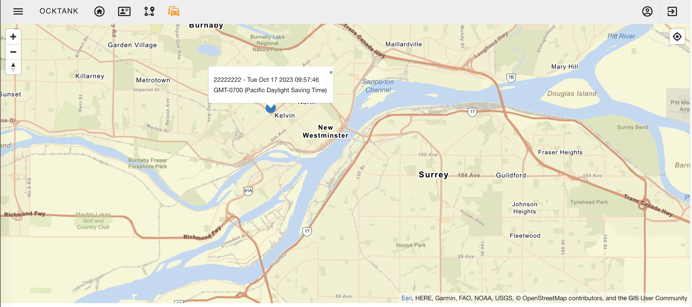
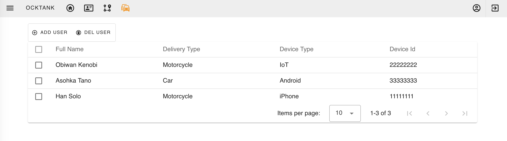
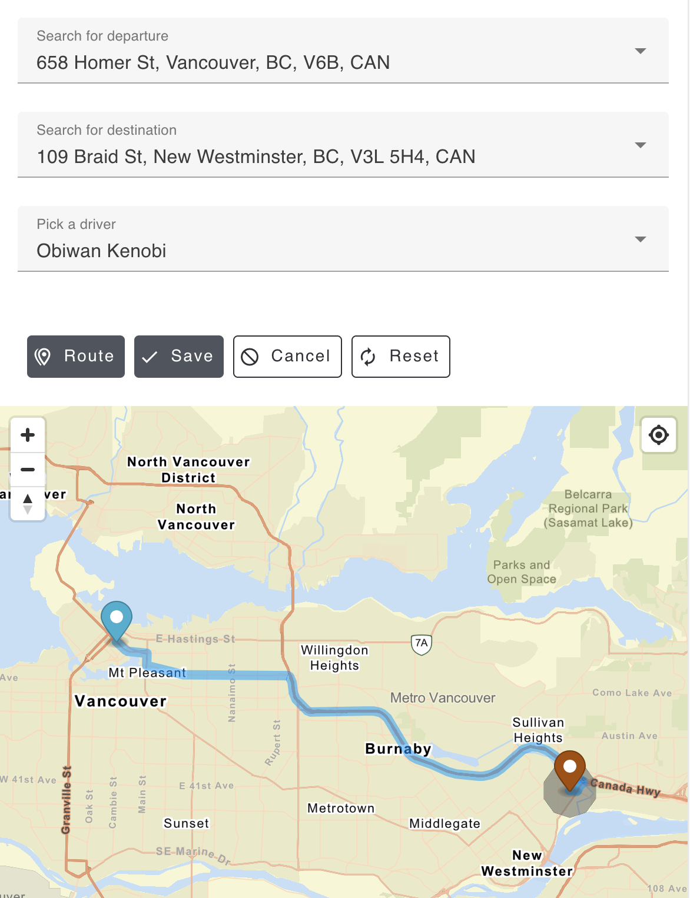

## Amazon Location Service GeoTrack Vue.js

Location data is a vital ingredient in today's applications, enabling capabilities ranging from asset tracking to location-based marketing. 

With [Amazon Location Service](https://aws.amazon.com/location/), you can easily add capabilities such as maps, points of interest, geocoding, routing, geofences, and tracking to applications. You retain control of your location data with Amazon Location, so you can combine proprietary data with data from the service. Amazon Location provides cost-effective location-based services (LBS) using high-quality data from global, trusted providers Esri and HERE Technologies.

This repo contains a Vue.js application that displays the users last positions reported in the past 15min in a map, leveraging Amplify for authentication. In the Amplify build process, there is automation that automattically creates the Amazon Location Services' resources and associate a policy to Amazon Cognito role for accessing them. 

## Architecture Overview

## Stack

* **Front-end** - Vue.js as the core framework, [Quasar](https://quasar.dev/) for UI, [MapLibre](https://github.com/maplibre) for map visualiztion, [AWS Amplify](https://aws.amazon.com/amplify/) for Auth UI component and AWS integration. 
* **Data** - User data is saved in [Amazon DynamoDB](https://aws.amazon.com/dynamodb/) via GraphQL using [AWS AppSync](https://aws.amazon.com/appsync/). Devices GPS positions are stored in Amazon Location Service Tracker. 
* **Auth** - [Amazon Cognito](https://aws.amazon.com/cognito/) provides JSON Web Tokens (JWT) and along with AppSync fine-grained authorization on what data types users can access.
* **IoT** - [AWS IoT](https://aws.amazon.com/iot/) with topics and rules integrated with an [AWS Lambda](https://aws.amazon.com/lambda/). 

## User Interface

#### Real-time tracking visualization

#### Managing Delivery Agents

#### Managing Delivery Routes

## Testing the solution

At the toolbar there is a fire icon button. Upon clicking this button, the application will simulate the existent delivery routes. An AWS Lambda reads the start and end positions of each delivery route, calculates the route and sends IoT messages with the IoT devices associated to the delivery agents reporting their geo-location over time. The application does not prevent having two routes with the same IoT device, which will produce inconsistent position.

# Deployment
To deploy this solution into your AWS Account please follow our [Deployment Guide](./docs/deployment_guide.md)

## Security

See [CONTRIBUTING](CONTRIBUTING.md#security-issue-notifications) for more information.

## License

This library is licensed under the MIT-0 License. See the LICENSE file.

