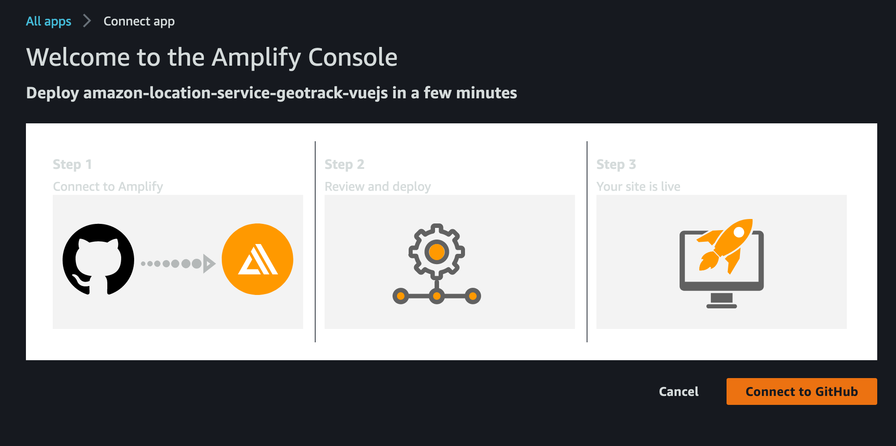
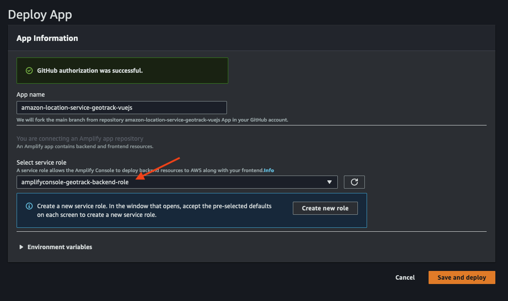
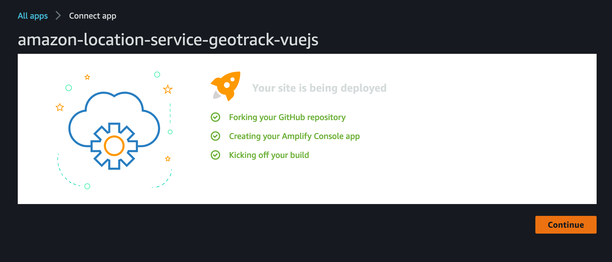

# Requirements
Before you deploy, you must have the following in place:
*  [AWS Account](https://aws.amazon.com/account/) 
*  [GitHub Account](https://github.com/) 
*  [AWS CLI](https://aws.amazon.com/cli/) 
*  [AWS SAM](https://aws.amazon.com/serverless/sam/) 
 
# Step 1: Front-end deployment

Before installing Amplify we need to create the IAM Role that associate the policies need to implement this solution. From the cloned directory, execute the follow CloudFormation template: 

```bash
aws cloudformation deploy --template-file cfn-amplifyRole.yaml --stack-name geotrack-amplify-role --capabilities CAPABILITY_NAMED_IAM
```

It creates the role name **amplifyconsole-geotrack-backend-role** that will be used on the next step.

The **Deploy to Amplify Console** button will take you to your AWS console to deploy the front-end solution.

<a href="https://console.aws.amazon.com/amplify/home#/deploy?repo=https://github.com/aws-samples/amazon-location-service-geotrack-vuejs">
    
</a>


The follow screenshots shows how simple this step is:

1. 

2. 

3. 

4. 

# Step 2: Back-end deployment

In this step we create the IoT Core and associate it to the AWS Lambda function, so it can send the GPS coordinates to Amazon Location Service Tracker. We also create the AWS Lambda functions to simulate a route in the application. To do so, execute the following command from the cloned repo. 

The backend relies on resources that needed to be created during the front-end deployment, please make sure to proceed after Amplify has successfully deployed the application. 


```bash
sam deploy -g --capabilities CAPABILITY_IAM CAPABILITY_AUTO_EXPAND CAPABILITY_NAMED_IAM
```

In the questions, provide the stack-name as geotrack-backend the region you are deploying the solution and accept all the default options. The output should be similar to:

```bash
Stack Name [sam-app]: geotrack-backend
AWS Region [us-east-1]: us-west-2
Parameter ProjectName [geotrack]:
Parameter EnvironmentName [main]:
Parameter CorsOrigin ['*']:
Parameter CorsHeaders ['Content-Type,X-Amz-Date,Authorization,X-Api-KeyX-Amz-Security-Token']:
Parameter CorsMethods ['OPTIONS,POST']:
#Shows you resources changes to be deployed and require a 'Y' to initiatedeploy
Confirm changes before deploy [y/N]: y
#SAM needs permission to be able to create roles to connect to theresources in your template
Allow SAM CLI IAM role creation [Y/n]: y
Save arguments to configuration file [Y/n]: y
SAM configuration file [samconfig.toml]:
SAM configuration environment [default]:
```

Confirm the deploy of the changeset and wait for the to finish.